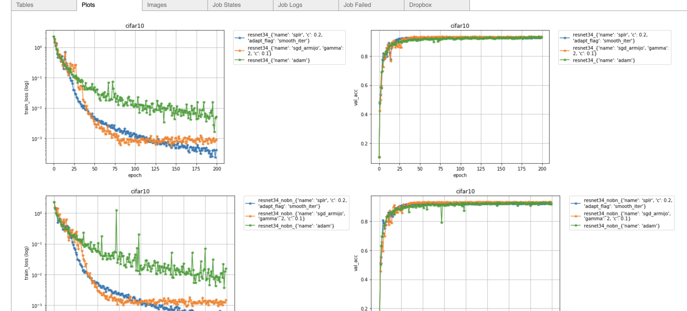

<!-- <table>
    <thead>
        <tr>
            <th style="text-align:center;"></th>
        </tr>
    </thead>
    <tbody>
    </tbody>
</table> -->
# Haven 

A library for defining hyperparameters, launching and managing many experiments, and visualizing their results. If you have access to the [orkestrator](https://www.elementai.com/products/ork), you can run and manage thousands of experiments in parallel.

### Install
```
$ pip install --upgrade git+https://github.com/ElementAI/haven
```

<!-- /home/issam/Research_Ground/haven/ -->

### Examples

The following are example projects built using this library.

- [Minimal](https://github.com/ElementAI/haven/tree/master/examples/minimal) - we recommend this example as a starting point for using Haven.
- [Classification](https://github.com/ElementAI/haven/tree/master/examples/classification) - train MLP on MNIST.
- [Active Learning](https://github.com/ElementAI/haven/tree/master/examples/active_learning) - train MLP with active learning on MNIST.
- [Object Counting](https://github.com/ElementAI/haven/tree/master/examples/object_counting) - train LCFCN on Trancos.
- [Semantic Segmentation](https://github.com/ElementAI/haven/tree/master/examples/semseg) - train FCN8 on Pascal.
- [Instance Segmentation](https://github.com/ElementAI/haven/tree/master/examples/semseg) - train Mask-RCNN on Pascal.


### Usage

#### 1. Write the codebase

A minimal codebase can include the following 4 files. Each of these files is hyper-linked to a template source code.

- [`exp_configs.py`](https://github.com/ElementAI/haven/tree/master/examples/minimal/exp_configs.py) contains experiment groups for MNIST.
- [`trainval.py`](https://github.com/ElementAI/haven/tree/master/examples/minimal/trainval.py) contains the main training and validation loop for an experiment.
- [`datasets.py`](https://github.com/ElementAI/haven/tree/master/examples/minimal/datasets.py) contains the code for acquiring a Pytorch dataset.
- [`models.py`](https://github.com/ElementAI/haven/tree/master/examples/minimal/models.py) contains the code for acquiring a Pytorch model.

#### 1. Run the Experiments

After writing the codebase, we can run the `mnist` experiment group by following one of the two steps below.

##### 2.1 Run trainval.py in Command Line

The following command launches the mnist experiments and saves their results under `../results/`.

```
python trainval.py -e mnist -sb ../results -r 1
```

##### 2.2 Using the orkestrator

The orkestrator allows us to run all the experiments in parallel. Note that we will be able to view their status and logs using the visualization script in Section 4. To request access to the orkestrator please visit the [orkestrator website](https://www.elementai.com/products/ork).

Define a job configuration  and add it to [`trainval.py`](https://github.com/ElementAI/haven/tree/master/examples/minimal/trainval.py) (see example),

```
job_config = {'data': <data>,
            'image': <docker image>,
            'bid': '1',
            'restartable': '1',
            'gpu': '4',
            'mem': '30',
            'cpu': '2'}
```

Then run the following command,

```
python trainval.py -e mnist -sb ../results -r 1 -j 1
```
The `-j 1` argument launches each experiment in `exp_list` concurrently and a job id is assigned to each experiment. 

#### 3. Visualize the Results

The following two steps will setup the visualization environment.

##### 3.1 Launch Jupyter

Run the following in command line to install a Jupyter server
```bash
jupyter nbextension enable --py widgetsnbextension --sys-prefix
jupyter notebook
```

or if you are working using an open-ssh server, run the following instead,

```
jupyter notebook --ip 0.0.0.0 --port 9123 \
      --notebook-dir="/home/$USER" --NotebookApp.token="password"
```

##### 3.2 Run Jupyter script

Run the following script from a Jupyter cell to launch a dashboard.


```python
from haven import haven_jupyter as hj
from haven import haven_results as hr
from haven import haven_utils as hu

# path to where the experiments got saved
savedir_base = <insert_savedir_base>
exp_list = None

# exp_list = hu.load_py(<exp_config_name>).EXP_GROUPS[<exp_group>]
# get experiments
rm = hr.ResultManager(exp_list=exp_list, 
                      savedir_base=savedir_base, 
                      verbose=0
                     )
# launch dashboard
hj.get_dashboard(rm, vars(), wide_display=True)
```

This script outputs the following dashboard.




### Contributing

We love contributions!
